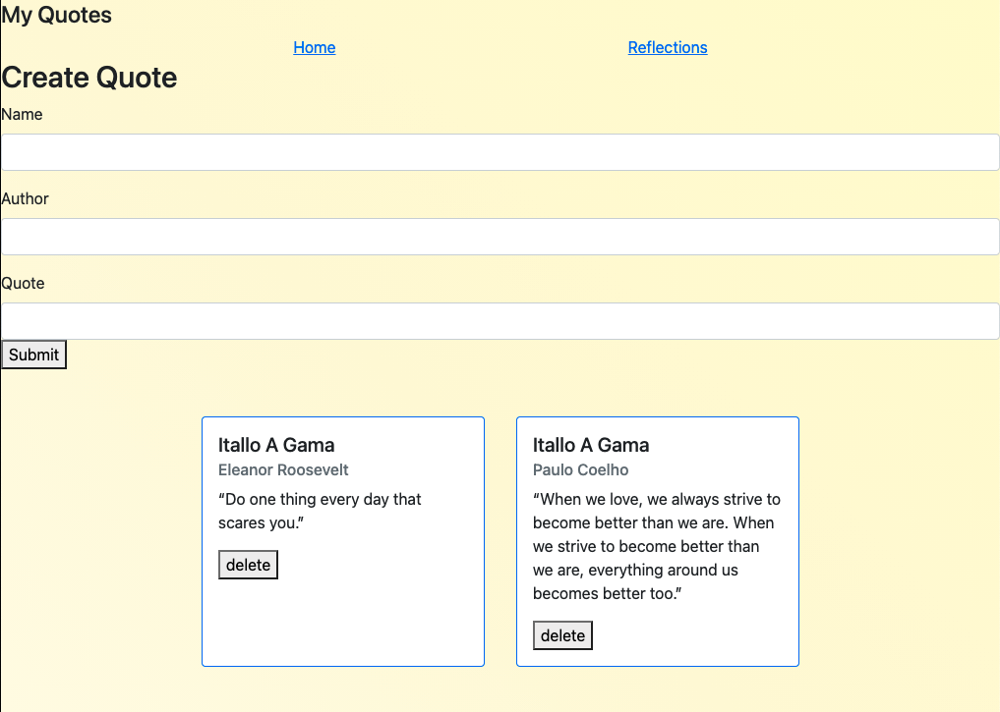
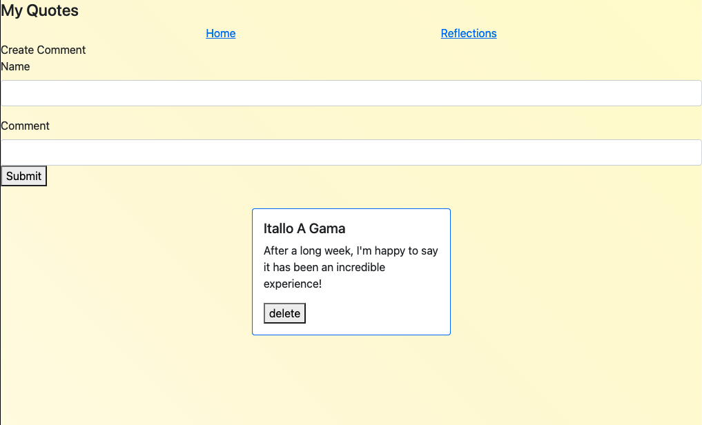

# InspireMe

## Date: 09/03/2021

### By: Itallo Gama 
 
[GitHub](insertLink) |  [LinkedIn](insertLink)  |  [Inspire](insertLink)

***

### ***Description***
Interact with quotes or pasages shared by other users. And keep a personal log of your thoughts, quotes, and accomplishments.

### ***Techmologies used***

* React
* MongoDB
* Mongoose
* CSS
* Express

### ***Getting started***

Using the link to access the InspireMe site, and start working and bettering yourself.

### ***Screen Shots***

#####  ***Quotes Page***

##### ***Reflections Page***

### ***Future Updates***

- [x] Incorporate Bootstrap
- [ ] Comments added to quotes
- [ ] dedicated landing / home page
- [ ] update to 3rd party API

***credits***
* [BootStrap](https://getbootstrap.com/)
* [StackOverflow](Link)
